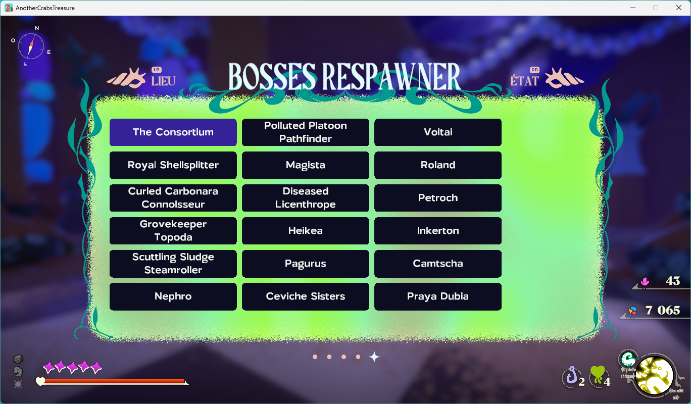

<!-- PROJECT LOGO -->
<br />
<div align="center">
  <h3 align="center">ACTBossesRespawner</h3>
</div>

<!-- Shield -->

[![Contributors][contributors-shield]][contributors-url]
[![Download][download-shield]][download-url]
[![Forks][forks-shield]][forks-url]
[![Stargazers][stars-shield]][stars-url]
[![Issues][issues-shield]][issues-url]
[![MIT License][license-shield]][license-url]

<!-- ABOUT THE PROJECT -->

# About The Project

A mod (steam version) for the game `another crab's treasure` ,for re fighting mandatory/optionnal bosses ,no less no more.

# Disclaimer

- ⚠️ Backup your save data ⚠️ . It's not mandatory but since the mod edit the in game save data (and the game will auto save most of the time), you might be able for some reason to corrupt your save data.
  The game save data are located at `{your disk}:\Users\{your windows user name}\AppData\LocalLow\Aggro Crab\AnotherCrabsTreasure` with the 3 save folder. You can manually make a copy of the `.crab` files or just copy the whole `AnotherCrabsTreasure` folder somewhere (you will have to manually copying back for restoring)

- The mod was built/tested for windows and for the game version `1.0.102.5` (latest as 24/05/2024) meaning it might not work for older nor next update

# Usage

It fairly easy to install this mod:

1. Install [BepInEx](https://github.com/BepInEx/BepInEx/releases/latest) (download according to your OS, for example if you use a 64bit Windows , you need the `_win_x64` one ) to your game. You can follow this [guide](https://docs.bepinex.dev/articles/user_guide/installation/index.html) for help .
2. Run the game once (to like at least to title screen) and confirm that you have the file at `{your game directory location}/BepInEx/LogOutput.txt` . This is for confirming that BepInEx is correctly installed
3. Download the latest mod [release](https://github.com/Fcornaire/ACTBossesRespawner/releases/latest)
4. Install the mod by copying the mod to `{your game directory location}/BepInEx/plugins` (meaning you now should have `{your game directory location}/BepInEx/plugins/ACTBossesRespawner/ACTBossesRespawner.dll` )

If all done correctly, when entering the pause menu and navigating the menu tabs, you should be able to see the respawn tab.

<p align="center">
  
</p>

Select a boss to be teleported to the boss location and start the fight !

Depending of the boss, it also advised to finish all related next event (dialogue, re acquiring power up, etc) related to the boss before going to another boss. You might get some unexpected behaviour if not.

# Features

Beside the re spawn, the mod offer :

- Ability to force a rebalance on kril. To do so:

  1. Create a folder name `modifier` in the mod directory (it should look like `{your game directory location}/BepInEx/plugins/ACTBossesRespawner/modifier`)
  2. In the created `modifier` directory, add a new text file named something like `stats.json` (yeah, force the extension change if windows ask)
  3. `stats.json` need to look like

  ```json
  {
    "ATK": 5,
    "VIT": 5,
    "GMS": 5,
    "RES": 5
  }
  ```

  with each stat being the leveled stat you will overwrite

  4. Now each time you will re load a boss, those stats will be applied at the start of the fight and will be removed at the end. Delete the file `stats.json` when you are done.

- F5: Restore your initial save data. The mod will backup your original save data the first time you try to re load a boss. This is another backup just in case that will be located at `{your disk}:\Users\{your windows user name}\AppData\LocalLow\Aggro Crab\AnotherCrabsTreasure/BackupByModBossesRespawner`. F5 to restore that save (nothing will happen if you didn't re load a boss yet since the backup happen the first re load). Do not hesitate to use that feature if you want a quick original save restore. Again , ⚠️ Backup your save data ⚠️ to be safe , you have been warned (to be fair, i don't think you can corrupt your save data that easily but you never know...)

- F6: Toggle the dev debug mode, open the pause menu and navigate throught the tabs to see the debup tab . You will acces debug feature. (You don't need that by the way, i mostly use the `warp to shell` feature and was lazy enough to remove the feature properly)

# Known bugs

- Out of place environnement music
- Losing adaptation -> dunno why it's happenning but you can "fix" this by just reloading the game (Going to the title screen and reload your save)

<!-- MARKDOWN LINKS & IMAGES -->
<!-- https://www.markdownguide.org/basic-syntax/#reference-style-links -->

[contributors-shield]: https://img.shields.io/github/contributors/Fcornaire/ACTBR.svg?style=for-the-badge
[contributors-url]: https://github.com/Fcornaire/ACTBR/graphs/contributors
[forks-shield]: https://img.shields.io/github/forks/Fcornaire/ACTBR.svg?style=for-the-badge
[forks-url]: https://github.com/Fcornaire/ACTBR/network/members
[stars-shield]: https://img.shields.io/github/stars/Fcornaire/ACTBR.svg?style=for-the-badge
[stars-url]: https://github.com/Fcornaire/ACTBR/stargazers
[issues-shield]: https://img.shields.io/github/issues/Fcornaire/ACTBR.svg?style=for-the-badge
[issues-url]: https://github.com/Fcornaire/ACTBR/issues
[license-shield]: https://img.shields.io/github/license/Fcornaire/ACTBR.svg?style=for-the-badge
[download-shield]: https://img.shields.io/github/downloads/Fcornaire/ACTBR/total?style=for-the-badge
[download-url]: https://github.com/Fcornaire/ACTBR/releases
[license-url]: https://github.com/Fcornaire/ACTBR/blob/master/LICENSE.txt
